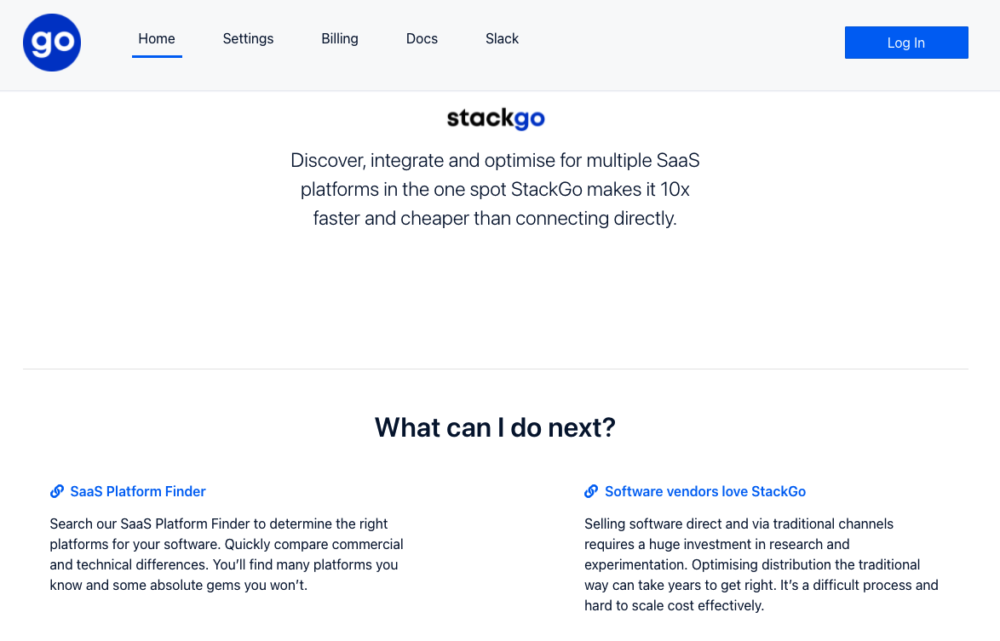
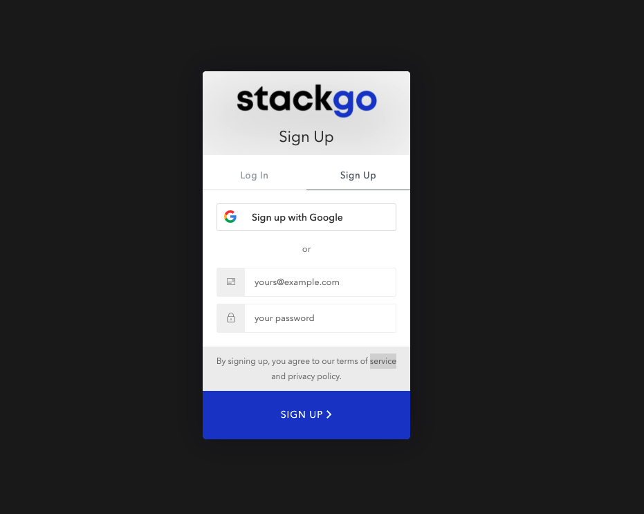
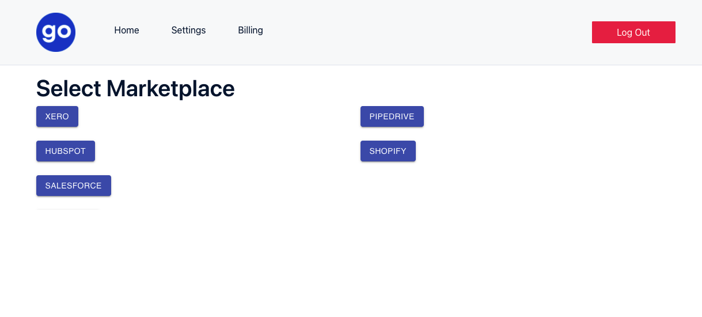

# Sign up to with StackGo

Aim: This tutorial will help you sign up for an account with StackGo

## 1. Go to the app landing page: `https://app.stackgo.io`

StackGo homepage

## 2. Click on `Log In` on the top right

## 3. Click on `Sign Up`

## 4. Follow onscreen instructions to `Sign Up`

## 5. You will now on logged in and on the `Select Marketplace` page

[Continue by generating some hubspot credentials](docs/Auth0/2. Generate Hubspot Credentials.md)