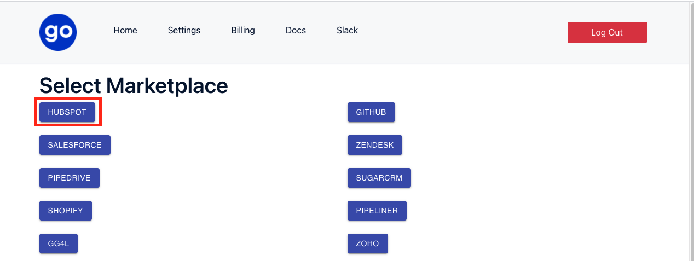

## Configure Hubspot connector with StackGo

### Open [StackGo](https://app.stackgo.io/select-marketplace)

### Pick a short nickname for your integration 

Copy and paste the hubspot app page, called `Client ID`, `Client Secret` and `App ID` to Stackgo fields `Client Id` , `Client Secret` and `App Id`. 

Select the same scopes as done on the Hubspot - or `contacts` and `forms` if you are following along 

[Hubspot Fields](https://www.notion.so/61ccb7571be24e65a57a921c51e8d43c)

