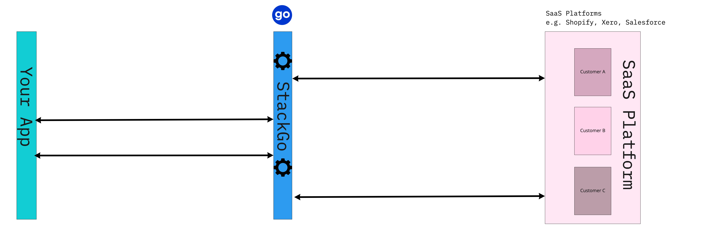
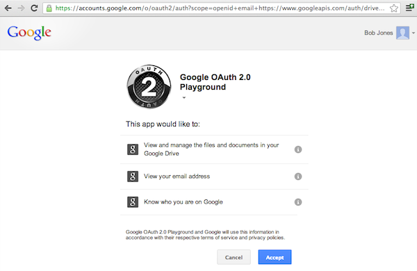

# StackGo Philosophy 🧠

SaaS platforms are more ubiquitous than ever. They’re growing in popularity in an increasingly congested and finely stratified SaaS market. Product integrations into SaaS platforms can be a channel for growth, improving customer retention, creating seamless customer journeys and a hotbed for innovation on your core offering. We have written a lot about the importance of SaaS integrations on our blog, [feel free to check out this post](https://stackgo.io/software-marketplaces-for-growth/).

At StackGo we realise that devlopment time is a limiting factor in how many product integrations get built. Since each platform has its own data model, oAuth implementation and mode of operations. Therefore we are deeply commited to our vision of an ecosystem of developer tools that boost effiancy by a factor of 10 by reducing to allow for faster iterations and greater agilty. 

We have also written extensivley about how to find your ideal use-case for building product integrations for product and technology leaders. Please see [this blog for more details](https://stackgo.io/data-integration-and-saas-marketplaces/) 

### StackGo Suite 📚

#### Managed Authentication 

<!-- theme: success -->
> StackGo's core value proposition is to enable SaaS providers to allow their users to connect the SaaS platforms they already use to create seamless user experince.

All SaaS product integrations require authorization and authentication before any data can be transacted, this is where managed authentication comes in! 
StackGo offers its managed authentication to allow developers to get started quickly with oAuth based platforms with a standardised approache that is state of the art and secure implementation. Hence developers can focus on building features for customers rather than being bogged in the minutiae of authentication. It also reduces the cost of experimentation and starting integrations with new platforms.  

Interested in learning more? Please work through our tutorial for [a tutorial](linik)

#### Unified APIs

While helping customers with the their SaaS product integrations we worked with a large number of SaaS platforms that have similar offerings within a vertical. However due to differing views in API design and product terminology they refer to the same canonical elements of a domain with differing terminology and support different operations. 
Since StackGo is the nexus off all oAuth based connections as per the `Managed Authentication` offereing we added a layer of API translation that creates a notional standard for common resources within a vertical. For example, with CRMs, StackGo can define a standard for `Contact` and define CRUD operations and fields that can be applied to any CRM.

> Want to see it in action? Here is an article that works its way through [an example](Unified-API-An-early-look.md)

#### FaaS - Function as a Service

APIs provided by SaaS platforms are the elemental operations for building workflows for SaaS product integrations. Often times a number of these operations need to be strung together to create a workflow that adds value to the end-users journey. With our `FaaS` offering we provide an easy to use interface to compose powerful workflows without having a large burden of changes on your existing code bases and having a very desireable de-coupliing of integration logic code from main applicaiton.

> Ready to explore? Please get in [touch](mailto:team@stackgo.io)

### Technical Architecture (High Level)

StackGo at its core is an API middleware solution and it helps shield you application and devlopers from the complexity of the API standards and authentication systems. In doing so, stackgo offers an alternative approach to managing authentication with third party systems by creating a secure standardised approach. By offloading aspects of token managments and the power up from the unified apis and faas stackgo's offerings will boost your team's productivity without sacrificing the quality.

<!-- theme: warning -->
> ### Key Concepts
>From a technical implementation point of view there are a few concepts to introduce to make the most of the StackGo platform.

Note: Here we use the generic term `SaaS Platform` to represent any modren api eneabled multitenated SaaS offering such as Shopify, Salesforce, Xero and others.

The basic steps to get started are:

- Register a developer acccount on the SaaS platform

- Generate oAuth credentials (`client id`, `client secret,` `permissions`)

- Sign up for StackGo and configure the connector for your SaaS platfrom with credentials from the previous step

- StackGo will generate a custom `redirect url`, register this url with the SaaS platform

- Follow `Generate Authorization Link` API to generate an installation link. You might to have access to a trial or developer version of the SaaS platform to use the link.

- Complete the app installation via StackGo via the consent screen and then you can you the `proxy calls` api to start transacting data as per the API documentation

Example of a google consent screen:

#### App Credentials Identifier `appSlug`
Each set of credentials  (`client id`, `client secret,` `permissions`) generated from the SaaS platform are referenced with an identifier in StackGo called the `appSlug`. This is important since it allows developers to maintain several integrations for each SaaS platform which is important to allow for different credentials for each enviroment (dev/test/prod) or for custom integrations differnet clients. 

#### User Foreign Identifer `userForeignIdentifer`
StackGo allows developers to register multiple users from their application to connect with their instance of the SaaS platfrom. E.g. Offering user the ability to connect to their shopify accounts and sync orders. To enable this, StackGo API consumers need to assign an user identifier for each API call they make. This usually takes the form of a indentifier that is already in the system that denotes a unique tenant such a `email`, `user id`, `organization id`, `uuid` and so on. 

### Tutorial 
Can't wait to get started? 
[Follow along for a guided tour on how to use StackGo to make SaaS integrations easier](tutorial). 

