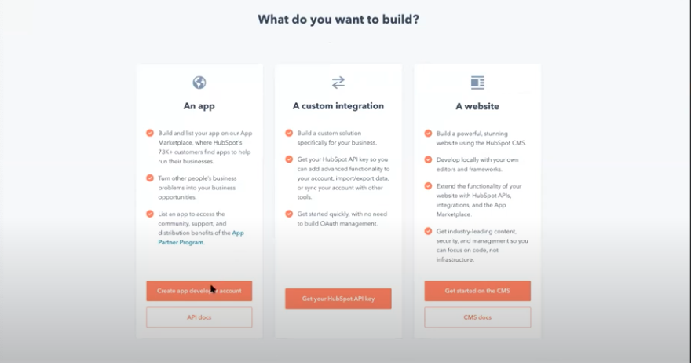
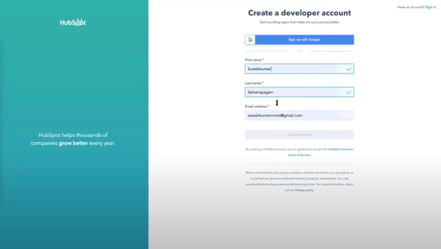
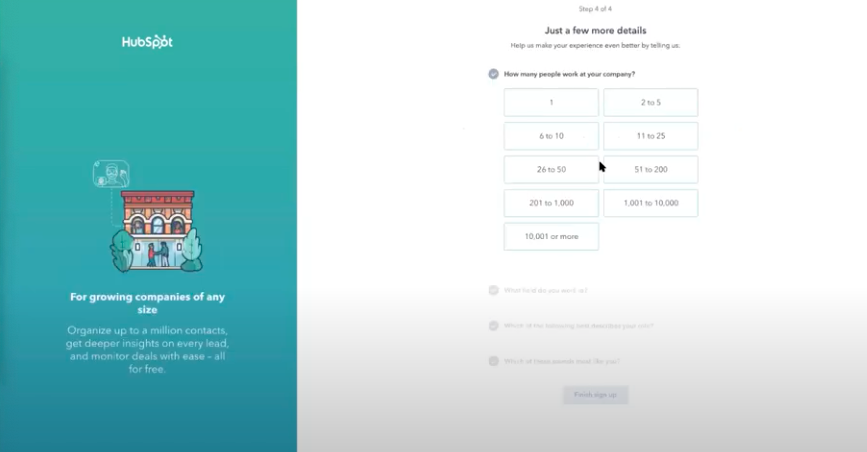
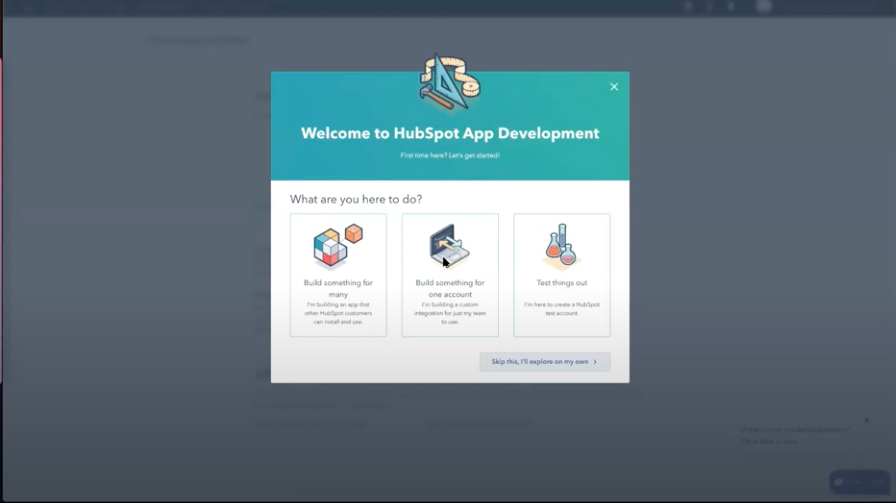
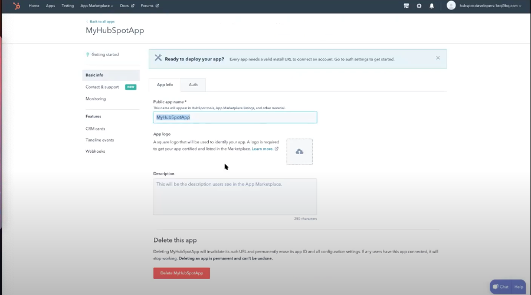
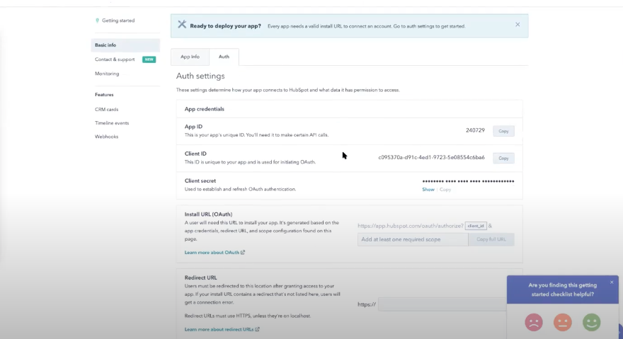
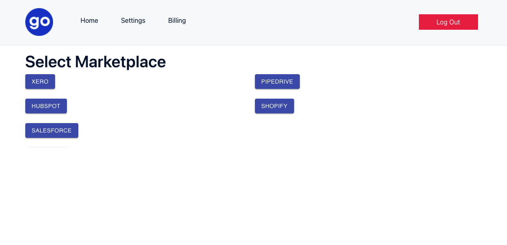

# Getting Started - Hubspot

**Aim:** To have a StackGo powered capability to authenticate with Hubspot and then being able to make proxy requests via StackGo to query their data. 

You never have to store credentials, change your database or understand how even the underlying auth system behaves!

**Pre-requisites:** We assume that you have gone through the `[StackGo Philosophy](docs/Docs Home.md)` tutorials and have a StackGo account and the access credentials for API access

## 1. Sign up for a developer account - [https://developers.hubspot.com](https://developers.hubspot.com/get-started)

### Choose `An App` and continue



### Complete the sign up form



Note: you might have to verify your email by clicking on a email link

### Provide a phone number for `2FA` or skip


### Fill in some company details



### Select `Build something for many` on the welcome screen



### Go to Basic info > Auth to see the App Credentials

Hubspot by default creates an app called `MyHubspotApp` and we can use that for this example.





Select a few scopes, if you are unsure and want to follow along select `Contacts` and `Forms`

Congratulations, you now have generated API credentials, move on to the next section and see how StackGo can get you started with executing API calls against Hubspot api in just a moment.

## 2. Pass credentials to StackGo

### Open StackGo (`app.stackgo.io/select-marketplace`) (assuming you are logged in)



### Pick a short nickname for your integration - feel free to match the name on the hubspot platform or `hbdev` also works well.

Copy and paste the  hubspot app page, called `Client ID`, `Client Secret` and `App ID` to Stackgo fields `Client Id` , `Client Secret` and `App Id`. Pay extra attention to ensure the values are not pasted in the wrong fields. 

Select the same scopes as done on the Hubspot - or `contacts` and `forms` if you are following along 

[Hubspot Fields](https://www.notion.so/61ccb7571be24e65a57a921c51e8d43c)

## 3. Update Hubspot platform with the StackGo Api

This will allow StackGo to execute the OAuth dance on your behalf


Hit save and you are set!

When you sign up for a developer account, Hubspot also generates a sandbox instance for you to test you API against. Basically this instance can be used to test out the API capability.

## 4. Register your Hubspot customer with StackGo

If you haven't already generate the StackGo credentials, see [Requesting your StackGo Authentication Tokens](https://www.notion.so/Requesting-your-StackGo-Authentication-Tokens-89b1ab9f852a407ea267a54957f30ff7) 

Now to activate the Hubspot connection, we will follow a simulate the simple process that showcases the power of StackGo. As the app developer, you can recreate that within your platform and start unleashing integration use cases!

### 4.1 Generate the install link with user foreign identifier

The code to generate the Hubspot install link will be as follows:

```java
curl --location --request GET 'https://api-dot-stackgo-300922.ts.r.appspot.com/api/hubspot/auth/hbDev?userForeignIdentifier=<user id>' \
--header 'Authorization: Bearer <your StackGo Auth token>'
```

 `userForeignIdentifier` is a simple 1:1 mapping of your user - put any UUID or string here that you use to refer to your users.

`hbdev` is the appslug that we selected in Step 2 along with the token to authenticate users.

The response from that API will be of the shape

```json
{
    "url": "https://app.hubspot.com/oauth/authorize?client_id=fcdc0161-59d5-428f-864f-629d8aa781ec&scope=contactsforms&redirect_uri=https%3A%2F%2Fapi-dot-stackgo-300922.ts.r.appspot.com%2Fhubspot%2Fhbdev-9804bf30-ca1b-4716-ad64-b5d84f10d98f%2Fcallback&state=test%40user.com",
    "userForeignIdentifier": "test@user.com",
    "UUID": "9804bf30-ca1b-4716-ad64-b5d84f10d98f"
}
```

This install link is the action behind the `Connect to Hubspot` button or similar. You can simulate a user clicking on that button by opening the url in a browser window. 


It will take you to the Hubspot page, if you were logged in it will take you to the `Authorization Page` where the user can authorise access to their Hubspot data. 

## Use StackGo as a proxy

Now that the user has been registered via StackGo, we can use StackGo as a proxy which will pull the required information from the Platforms that have been integrated through it.

Essentially it is a `POST` request to StackGo with the same  `userForeignIdentifier` that was registered. You provide the HTTP method and the URL you want to access on the platforms side.

StackGo attaches the appropriate tokens and attempts to query the platform on your behalf and transparently passes the results back to you.

To execute a `POST` request you can pass through another option for the `body` that has the data to be associated with the request

